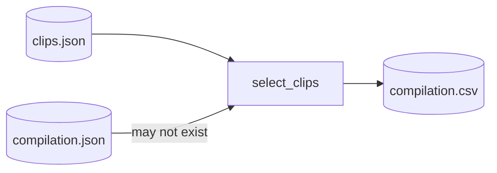
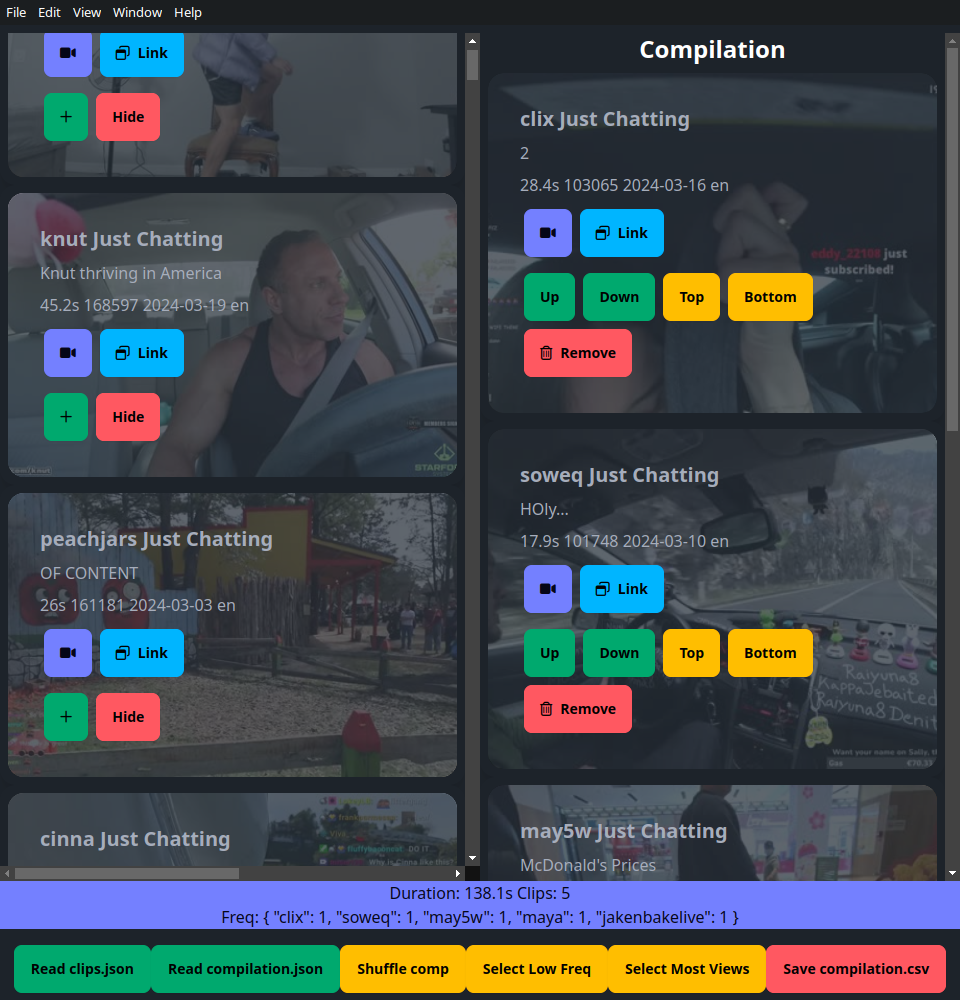
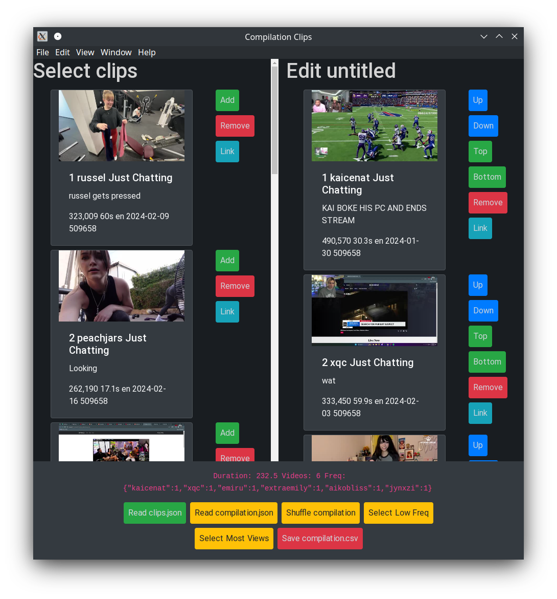

# video-compilations

<!-- PROJECT LOGO -->
 

  <h3 align="center">Select Clips and Edit Compilation</h3>

  

     
    <a href="https://github.com/jellemeeus/compilation-clips">Report a Bug</a>
    ·
    <a href="https://github.com/jellemeeus/compilation-clips">Request Feature</a>
  

<!-- TABLE OF CONTENTS -->

  
Table of Contents

  <ol>
    <li>
      <a href="#about-the-project">About The Project</a>
      <ul>
        <li><a href="#built-with">Built With</a></li>
      </ul>
    </li>
    <li><a href="#usage">Usage</a></li>
    <li><a href="#license">License</a></li>
    <li><a href="#acknowledgments">Acknowledgments</a></li>
  </ol>

<!-- ABOUT THE PROJECT -->
## About The Project
Rewrite of GUI https://github.com/jellemeeus/gui-compilation-from-cluster

Select/Edit clips

clips.json with clips to select.
compilation.json existing compilation

shows thumbnails with infinite scroller

GUI Screenshot

Old GUI
https://github.com/jellemeeus/gui-compilation-from-cluster

(<a href="#top">back to top</a>)

### Built With

* [![Electron.js][Electron.js]][Electron-url]
* Vuejs3
* DaisyUI
* Tailwindcs

(<a href="#top">back to top</a>)

<!-- GETTING STARTED -->
## Getting Started

Instructions

## Usage

In the project directory, you can run:

### `npm run dev`
### `npm run build`

(<a href="#top">back to top</a>)

<!-- ROADMAP -->
## Roadmap

(<a href="#top">back to top</a>)

<!-- ACKNOWLEDGMENTS -->
## Acknowledgments

(<a href="#top">back to top</a>)

<!-- MARKDOWN LINKS & IMAGES -->
<!-- https://www.markdownguide.org/basic-syntax/#reference-style-links -->
[contributors-shield]: https://img.shields.io/github/contributors/othneildrew/Best-README-Template.svg?style=for-the-badge
[contributors-url]: https://github.com/othneildrew/Best-README-Template/graphs/contributors
[forks-shield]: https://img.shields.io/github/forks/othneildrew/Best-README-Template.svg?style=for-the-badge
[forks-url]: https://github.com/othneildrew/Best-README-Template/network/members
[stars-shield]: https://img.shields.io/github/stars/othneildrew/Best-README-Template.svg?style=for-the-badge
[stars-url]: https://github.com/othneildrew/Best-README-Template/stargazers
[issues-shield]: https://img.shields.io/github/issues/othneildrew/Best-README-Template.svg?style=for-the-badge
[issues-url]: https://github.com/othneildrew/Best-README-Template/issues
[license-shield]: https://img.shields.io/github/license/othneildrew/Best-README-Template.svg?style=for-the-badge
[license-url]: https://github.com/othneildrew/Best-README-Template/blob/master/LICENSE.txt
[product-screenshot]: screenshot.png
[React.js]: https://img.shields.io/badge/React-20232A?style=for-the-badge&logo=react&logoColor=61DAFB
[React-url]: https://reactjs.org/
[Bootstrap.com]: https://img.shields.io/badge/Bootstrap-563D7C?style=for-the-badge&logo=bootstrap&logoColor=white
[Bootstrap-url]: https://getbootstrap.com
[Electron.js]: https://img.shields.io/badge/Electron-191970?style=for-the-badge&logo=Electron&logoColor=white
[Electron-url]: https://www.electronjs.org/