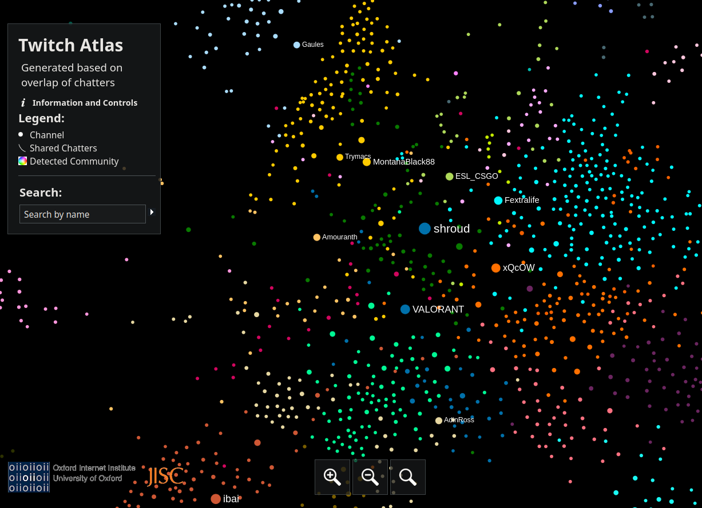

# twitch atlas

View of web page


# Exploring data

jq

```
❯ jq 'keys' < data.json
[
  "edges",
  "nodes"
]
```

```
❯ jq '.nodes[0]' data.json
{
  "label": "VooDooSh",
  "x": 1404.0650634765625,
  "y": -1439.7060546875,
  "id": "173",
  "attributes": {
    "Modularity Class": "2",
    "count": "61723"
  },
  "color": "rgb(255,130,255)",
  "size": 6.610489845275879
}
```

## Queries

### 1. Give unordered list of 5 relevant creators irregardless of cluster color

```
jq '. as $parent | $parent.nodes[] | select(.label=="Mizkif") | .id as $source | [$parent.edges[] | select(.source == $source)] | sort_by(.size) | reverse | map(.target) | .[0:5][] as $target | $parent.nodes[] | select(.id == $target) | .label' data.json
```
result:
```
"xQcOW"
"ludwig"
"sodapoppin"
"Nmplol"
"HasanAbi"
```

### 2. Give me unordered list of top 5 creators that are also in this creators group
```
jq '. as $parent | $parent.nodes[] | select(.label=="Mizkif") | .attributes."Modularity Class" as $mod | [$parent.nodes[] | select(.attributes."Modularity Class"=="0") ] | sort_by(.size) | reverse | .[0:5][] | .label' data.json
```
result:
```
"xQcOW"
"Trainwreckstv"
"ludwig"
"HasanAbi"
"sodapoppin"
```

### 3. Give me unordered list of top 5 creators based on distance
```
jq '[. as $parent | $parent.nodes[] | select(.label=="Mizkif") | . as {$id, $x, $y} | $parent.edges[] | select(.source == $id) | .target as $target | $parent.nodes[] | select(.id == $target) | .dy = ($y-.y)*($y-.y) | .dx = ($x-.x)*($x-.x) | .d = .dx + .dy] | sort_by(.d) | map(.label) | .[0:5][]' data.json
```
result:
```
[
  "HAchubby",
  "BotezLive",
  "jakenbakeLIVE",
  "39daph",
  "AnnaCramling"
]
```

### 4. Give me a lists of all creators by color

```
jq '. as $parent | [$parent.nodes | sort_by(.size) | reverse[] | {label: .label, color: .color}] | [group_by(.color)[] | map(.label)] ' data.json > test.json

```

# Selections / Playground

Orange labels

```
❯ jq '.nodes[] | select(.label=="Mizkif")' data.json
{
  "label": "Mizkif",
  "x": 1201.979248046875,
  "y": 618.433837890625,
  "id": "12",
  "attributes": {
    "Modularity Class": "0",
    "count": "152293"
  },
  "color": "rgb(255,112,0)",
  "size": 8.973662376403809
}
```

```
❯ jq '.nodes[] | select(.label=="ludwig")' data.json
{
  "label": "ludwig",
  "x": 1357.8924560546875,
  "y": 687.8349609375,
  "id": "25",
  "attributes": {
    "Modularity Class": "0",
    "count": "297541"
  },
  "color": "rgb(255,112,0)",
  "size": 12.763504981994629
}
```
selecting orange and sorts them by value with lowest dot at the bottom
```
jq '[.nodes[] | select(.attributes."Modularity Class"=="0")] | sort_by(.size) | reverse' data.json 
```
selecting orange and sorts them by value with lowest dot at the bottom showing only relevant fields
```
jq '[.nodes[] | select(.attributes."Modularity Class"=="0") | {name: .label, size: .size}  ] | sort_by(.size) | reverse' data.json > orange.json

```


```
jq '.nodes[] | select(.label=="Mizkif") | .attributes' data.json
```

query id as source for edges. grab top 5
```
jq '[.edges[] | select(.source == "12")] | sort_by(.size) | reverse | map({target: .target, size: .size})|  .[0:5]' data.json
```

Select nodes by id. nodes are in order of biggest draw.
return value is shuffled
```
jq '.nodes[] | select(.id  == ("15", "25",  "37",  "88",  "142"))' data.json
```


jq '.nodes[] | select(.label=="Mizkif") | .id as $id' data.json
jq '[.edges[] | select(.source == "12")] | sort_by(.size) | reverse | map(.target)|  .[0:5]' data.json


jq '. as $parent | $parent.nodes[] | select(.label=="Mizkif") | .id as $id | $parent.edges[] | select(.source == $id)] | sort_by(.size) | reverse | map(.target)|  .[0:5]' data.json


Get label then use label to search for top 5 biggest edges
```
jq '[.edges[] | select(.source == "12")] | sort_by(.size) | reverse | map({target: .target, size: .size})|  .[0:5]' data.json
```

without size, only target. Largest size at the start
```
jq '[.edges[] | select(.source == "12")] | sort_by(.size) | reverse | map(.target)|  .[0:5]' data.json
```
returns array of its

return labels of these ids


0. Find creator -> modularity class
for creator "Mizkif". case sensitive

```
jq '.nodes[] | select(.label=="Mizkif") | .attributes."Modularity Class"' data.json
```

1. Select me names and value of a particular group

for Modularity Class 0

```
jq '[.nodes[] | select(.attributes."Modularity Class"=="0") | {name: .label, size: .size}  ] | sort_by(.size) | reverse' data.json
```

2. Give top 10 of particular group

```
jq '[.nodes[] | select(.attributes."Modularity Class"=="0") | {name: .label, size: .size}  ] | sort_by(.size) | reverse | .[0:10]' data.json
```


7. Get 5 relevant channels by creator
Get their Ids
```
jq '. as $parent | $parent.nodes[] | select(.label=="Mizkif") | .id as $id | [$parent.edges[] | select(.source == $id)] | sort_by(.size) | reverse | map(.target) | .[0:5]' data.json
```


jq '. as $parent | $parent.nodes[] | select(.label=="Mizkif") | .id as $id | [$parent.edges[] | select(.source == $id)] | sort_by(.size) | reverse | map(.target) | .[0:5] as $ids | $parent.nodes[] | .id in ($ids)' data.json


// jq '.nodes[] | .id in ([ "15", "25",  "37",  "88",  "142"])' data.json


5. Get the label by id

```
jq '.nodes[] | select(.id=="12") | .label' data.json
```

6. Get labels by ids

```
jq '.nodes[] | select(.id= ["15", "25"]) | .label' data.json
```
4. Get the id of a creator
```
jq '.nodes[] | select(.label=="Mizkif") | .id' data.json
```


jq .nodes < data.json

jq 'keys' < clips.json
jq 'keys' < compilation.json